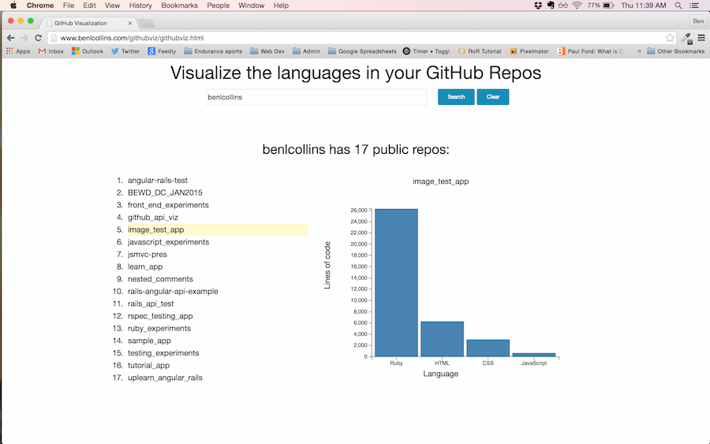

# GitHubViz

## What is it?

GitHubViz is a small tool to chart the languages in your GitHub repos, built using JQuery and d3.

## Where is it?

View at: http://www.benlcollins.com/githubviz/githubviz.html

## What does it look like?

